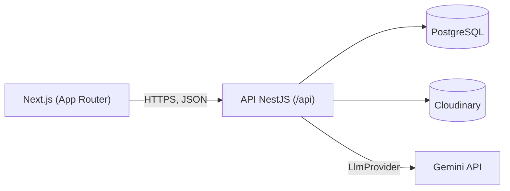
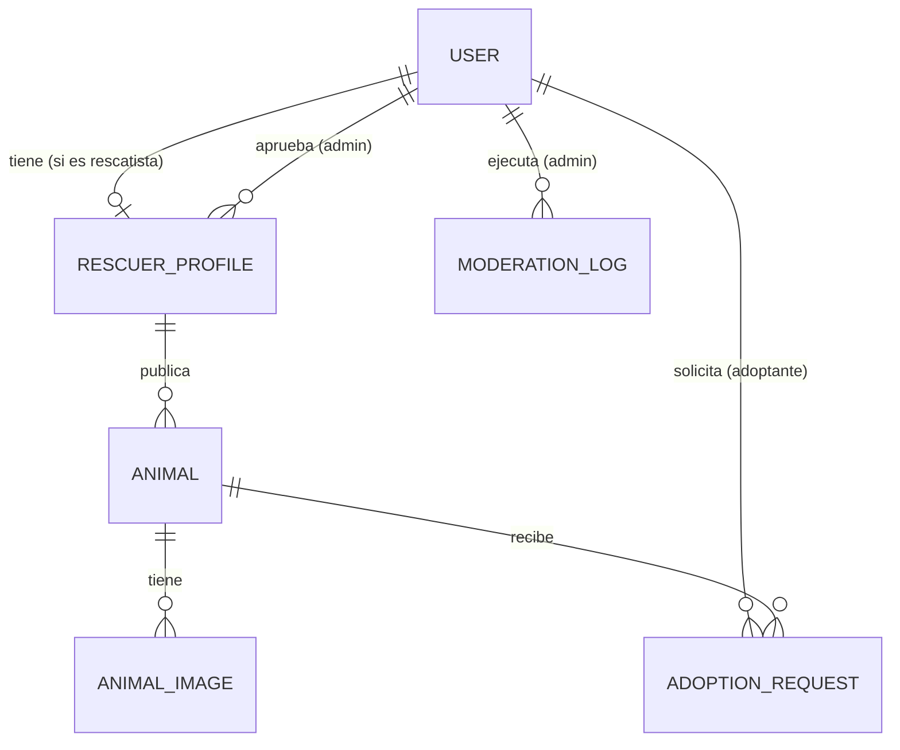

# PawConnect

Plataforma de adopción de mascotas que conecta fundaciones y rescatistas con adoptantes,
gestionando el proceso completo de solicitud, aprobación y seguimiento.

🔗 Demo: pendiente — se agrega cuando el catálogo tenga fotos reales cargadas

## El problema

Mi familia rescata perros y los publica en una cuenta de Instagram
([@VidasPeludasConFlow](https://www.instagram.com/rescatados_con_flow/)). Instagram sirve para que
la gente vea a los perros, pero no para lo que viene después: las solicitudes llegan por mensajes
directos y se mezclan con saludos, preguntas sueltas y gente que solo quiere ayudar. Una
publicación de hace tres semanas sigue circulando aunque ese perro ya tenga hogar, así que llegan
mensajes por perros que ya no están disponibles. No hay forma de saber cuántas personas
preguntaron por el mismo perro, en qué punto va cada conversación, ni a quién se le quedó de
responder — y cuando alguien interesado no recibe respuesta en un par de días, se enfría y no
vuelve a escribir.

El problema nunca fue la falta de gente dispuesta a adoptar. Era que el canal por donde llegaba
esa gente no estaba hecho para hacerle seguimiento a nada. PawConnect es el intento de arreglar
esa parte: cada mascota tiene una ficha con su estado (disponible, en proceso, adoptada) que se
actualiza sola según avanzan las solicitudes, y cada solicitud queda registrada con fecha e
historial en vez de perderse entre mensajes.

Es un proyecto personal, hecho por una sola persona, y está en uso real con perros reales
buscando hogar.

## Funcionalidades

**Adoptante**
- Registro e inicio de sesión
- Listado de mascotas disponibles con filtros (especie, tamaño, género, ciudad) y paginación
- Detalle de mascota con galería de imágenes
- Envío de solicitud de adopción con motivación
- Panel con sus solicitudes y su estado (pendiente, aprobada, rechazada, cancelada, finalizada), con opción de cancelar
- Edición de perfil, cambio de contraseña y eliminación de cuenta propia

**Fundación / rescatista**
- Registro (queda pendiente de aprobación por un administrador antes de poder publicar)
- Publicación de mascotas con múltiples imágenes (Cloudinary)
- Botón "Generar con IA" en el formulario de publicación: redacta la descripción a partir de los datos del animal (y de las notas que el rescatista ya haya escrito). El texto queda editable, con opción de deshacer, antes de publicar (ver [Descripciones con IA](#descripciones-con-ia))
- Edición y eliminación de mascotas e imágenes propias
- Panel con las solicitudes de adopción recibidas
- Aprobar, rechazar, finalizar o dejar en curso una solicitud — el estado de la mascota se actualiza automáticamente (ver [Decisiones técnicas](#decisiones-técnicas))

**Administrador**
- Panel con los rescatistas pendientes de aprobación, con botones para aprobar o rechazar
- Suspender o reactivar usuarios, y ver estadísticas agregadas — estas dos disponibles vía API, sin pantalla propia todavía (ver [Estado y siguientes pasos](#estado-y-siguientes-pasos))

**Público**
- Estadísticas reales en la landing (mascotas disponibles, adopciones finalizadas, fundaciones activas) vía `GET /api/stats`

## Stack

**Backend:** NestJS 11, Prisma 5, PostgreSQL, JWT (access + refresh token con revocación en logout), Cloudinary, Google Gemini (descripciones con IA)
**Frontend:** Next.js 16 (App Router), React 19, Tailwind CSS 4, shadcn/ui, Zustand, react-hook-form + zod, axios
**Despliegue:** Render (Blueprint: PostgreSQL + API + frontend)

## Arquitectura



## Modelo de datos



6 entidades: `User`, `RescuerProfile`, `Animal`, `AnimalImage`, `AdoptionRequest`, `ModerationLog`
(esta última registra cada acción de moderación de un admin: aprobar/rechazar rescatistas, suspender/activar usuarios).

## Decisiones técnicas

**NestJS** se eligió por su estructura modular con inyección de dependencias: cada dominio
(auth, animals, adoption-requests, admin...) queda separado en controller/service/DTOs, y los
guards de rol (`@Roles(...)`) se declaran de forma explícita sobre cada endpoint — importante en
una app con tres roles (adoptante, rescatista, admin) y reglas de autorización distintas por recurso.

**Access + refresh tokens con revocación:** el access token vive 15 minutos para limitar el daño
si se filtra; el refresh token vive 7 días para no forzar un login frecuente. El hash del refresh
token vigente se guarda en `User.hashedRefreshToken`, así que `POST /auth/logout` puede invalidarlo
de verdad del lado del servidor (antes de este cambio, el logout no revocaba nada: el refresh token
seguía siendo válido hasta su expiración natural aunque el usuario "cerrara sesión").

**Ciclo de estados de la mascota** (`DISPONIBLE → EN_PROCESO → ADOPTADO`, con vuelta a `DISPONIBLE`
si se cancela una solicitud aprobada): al aprobar una solicitud, la mascota pasa a `EN_PROCESO`
para que no reciba más solicitudes activas mientras se coordina la entrega; al finalizar, pasa a
`ADOPTADO`. Esta transición ocurre en una transacción de Prisma junto con la actualización de la
solicitud, para que ambos cambios queden consistentes.

**Imágenes en Cloudinary, no en el servidor:** Render usa almacenamiento efímero (se pierde en cada
redeploy), así que las imágenes de mascotas se suben directamente a Cloudinary y solo se guarda la
URL y el `publicId` en la base de datos.

**Proveedor de IA detrás de una interfaz:** la lógica de negocio (`PetDescriptionService`) depende de
la interfaz `LlmProvider`, no de Gemini. Un `useFactory` en `AiModule` lee `LLM_PROVIDER` y entrega la
implementación; cambiar de proveedor es escribir una clase nueva, agregar un `case` y cambiar una
variable de entorno, sin tocar el servicio. Un valor desconocido en `LLM_PROVIDER`, o una
`GEMINI_API_KEY` ausente, hace fallar el arranque en vez de fallar en la primera petición de un usuario.

**Decisión conocida — el access token vive en `localStorage`:** el refresh token también. Es más
simple de implementar que cookies `httpOnly`, pero significa que un XSS exitoso podría leer ambos
tokens. La alternativa correcta — refresh token en cookie `httpOnly` + `secure` + `sameSite`, access
token solo en memoria — requiere que el backend emita/lea esa cookie en login/refresh/logout y que
el cliente deje de inyectar el header `Authorization` desde `localStorage`, lo cual es un cambio de
punta a punta no trivial. Queda pendiente (ver [Estado y siguientes pasos](#estado-y-siguientes-pasos));
mientras tanto, el `ValidationPipe` estricto, el rate limiting y CORS restringido a orígenes
específicos reducen la superficie de ataque de XSS que podría explotar esto.

## Descripciones con IA

`POST /api/ai/pet-description` recibe los datos del animal y devuelve `{ description }`, un párrafo
de 60 a 100 palabras. Decisiones de diseño:

- **El modelo solo usa lo que se le da.** El prompt de sistema prohíbe inventar historia clínica,
  edad, vacunas o comportamiento. Los campos vacíos se filtran antes de armar el prompt, y
  `vaccinated`/`sterilized` solo se envían cuando son `true`: en la base `false` es el valor por
  defecto y puede significar "no se sabe", no "no está vacunado".
- **Instrucciones separadas de los datos.** Las reglas van en `systemInstruction` y los datos del
  animal, dentro de `<datos_del_animal>` en el mensaje de usuario, con la orden explícita de
  tratarlos como información y no como instrucciones. Es una defensa en profundidad contra
  inyección de prompt a través de campos de texto libre (como las notas), no una garantía absoluta.
- **Acceso y costo acotados.** Solo `RESCATISTA` y `ADMIN`; límite propio de 10 peticiones/minuto
  (cada llamada consume una cuota externa finita, a diferencia de un `SELECT`); y el DTO limita la
  longitud de cada campo (por ejemplo, 500 caracteres en `notes`) para que una sola petición no
  pueda agotar la cuota.
- **Fallas del proveedor contenidas.** Timeout de 20 s con `AbortController`; el detalle del error
  de Gemini se registra en el servidor y al cliente solo llega un 503 genérico, sin filtrar
  información del proveedor.
- **Nunca se devuelve texto truncado.** Los modelos Gemini 3 "piensan" antes de responder y esos
  tokens cuentan contra `maxOutputTokens`, así que con un límite bajo la respuesta se cortaba a mitad
  de frase. Se fija `thinkingLevel: "minimal"` y, además, si Gemini responde con
  `finishReason: MAX_TOKENS` se devuelve un 503 en vez del texto incompleto.
- **El humano siempre decide.** El texto generado cae en el mismo campo editable del formulario;
  no se publica nada sin que el rescatista lo revise.

## Seguridad

Medidas ya implementadas, además de las validaciones de autorización por objeto (IDOR) en cada
endpoint que opera sobre un recurso concreto (animales, imágenes, solicitudes):

- `ValidationPipe` global con `whitelist`/`forbidNonWhitelisted`: el cliente no puede inyectar
  campos como `role` o `status` en el cuerpo de una petición para escalar privilegios.
- Rate limiting (`@nestjs/throttler`): 5 intentos/minuto en login, registro y refresh; 10/minuto en
  creación de solicitudes de adopción; 10/minuto en la generación de descripciones con IA; 100/minuto
  en el resto de la API.
- `helmet`, límite de tamaño de petición (1MB) y CORS restringido a los orígenes de `FRONTEND_URL`
  (admite varios separados por coma, para producción + previews).
- Subida de imágenes: solo rescatistas autenticados, máximo 6 por animal, 5MB por archivo, y se
  valida la firma real de bytes del archivo (no el `Content-Type` ni la extensión, ambos
  controlados por quien hace la petición).
- Ninguna respuesta de la API incluye el hash de la contraseña ni el refresh token guardado.
- Mensajes de error de login genéricos ("credenciales incorrectas") tanto si el correo no existe
  como si la contraseña es incorrecta, para no revelar qué correos están registrados.
- Eliminación de cuenta propia (`DELETE /users/me`, confirmando con contraseña): anonimiza nombre,
  correo y teléfono en vez de borrar la fila, para no romper el historial de solicitudes/moderación;
  bloqueada si hay solicitudes o animales sin resolver. Política de tratamiento de datos en
  `/privacidad` (texto de referencia — reemplázalo por uno legal real antes de operar con usuarios
  reales).

**Backups:** los datos ahora pueden ser reales (contacto de personas, fichas de animales). Revisa
la retención que ofrece tu proveedor de Postgres en el plan gratuito y no asumas que existe un
backup automático. Como mínimo, corre `pg_dump` manualmente de forma periódica:

```bash
pg_dump "$DATABASE_URL" -F c -f "backup_$(date +%Y%m%d).dump"
```

## Cómo correrlo en local

Requiere Node **20.18.0** (ver `.nvmrc`), Docker (para Postgres local) y npm.

```bash
git clone https://github.com/Smithh15/pawconnect-adoption-platform
cd pawconnect-adoption-platform

# 0. Base de datos (Postgres en Docker)
docker compose up -d

# 1. Backend
cd backend
cp .env.example .env
# DATABASE_URL y DIRECT_URL ya apuntan a localhost:5432 (ver docker-compose.yml) si usas los
# mismos valores del .env.example. Completa JWT_SECRET, JWT_REFRESH_SECRET, CLOUDINARY_*,
# GEMINI_API_KEY (https://aistudio.google.com/apikey) y SEED_ADMIN_PASSWORD (usa una contraseña
# real, no el valor de ejemplo)
#
# Si el puerto 5432 ya lo ocupa otro Postgres (por ejemplo uno instalado en Windows), crea en la
# raíz del repo un archivo .env con POSTGRES_PORT=5433 y cambia el puerto en DATABASE_URL y
# DIRECT_URL de backend/.env. Docker Compose lee POSTGRES_PORT de la raíz, no de backend/.env.
npm install
npm run db:migrate     # aplica las migraciones de Prisma
npm run db:seed        # carga los datos de demostración
npm run start:dev      # http://localhost:4000/api

# 2. Frontend (en otra terminal)
cd frontend
cp .env.example .env.local
# NEXT_PUBLIC_API_URL=http://localhost:4000/api
npm install
npm run dev             # http://localhost:3000
```

Inicia sesión con `demo@pawconnect.com` / `demo1234` (adoptante) o
`fundacion@pawconnect.com` / `demo1234` (fundación).

## Despliegue en Render

El repositorio incluye un [`render.yaml`](render.yaml) (Blueprint) que declara los tres servicios:
una base PostgreSQL, la API (`pawconnect-api`) y el frontend (`pawconnect-frontend`). Al crear el
Blueprint desde el panel de Render (New → Blueprint, apuntando a este repo), lo siguiente queda
automático:

- Creación de la base de datos y conexión de `DATABASE_URL`/`DIRECT_URL` a la API
- `JWT_SECRET` y `JWT_REFRESH_SECRET` generados automáticamente
- Build de la API con `prisma migrate deploy` incluido (las migraciones se aplican en cada deploy)

Pasos manuales que quedan pendientes en el panel de Render después de crear el Blueprint:

1. En `pawconnect-api`, completar `CLOUDINARY_CLOUD_NAME`, `CLOUDINARY_API_KEY` y `CLOUDINARY_API_SECRET` con las credenciales de una cuenta de Cloudinary.
2. En `pawconnect-api`, completar `GEMINI_API_KEY` con una clave de [Google AI Studio](https://aistudio.google.com/apikey) (`LLM_PROVIDER` y `GEMINI_MODEL` ya vienen con valor en el Blueprint). Sin esta variable la API no arranca.
3. En `pawconnect-api`, completar `FRONTEND_URL` con la URL pública que Render asigna a `pawconnect-frontend` (necesaria para CORS).
4. En `pawconnect-frontend`, completar `NEXT_PUBLIC_API_URL` con la URL pública de `pawconnect-api` seguida de `/api` (ej. `https://pawconnect-api.onrender.com/api`).
5. Correr el seed una vez que la API esté desplegada: desde la Shell de Render del servicio `pawconnect-api`, definir `SEED_ADMIN_EMAIL`/`SEED_ADMIN_PASSWORD` como variables de entorno y ejecutar `npm run db:seed`.
6. Redesplegar `pawconnect-api` y `pawconnect-frontend` después de completar las variables de los pasos 1-4 (Render no reinicia automáticamente al editar variables de servicios ya desplegados en el mismo blueprint apply).

## Estructura del proyecto

```
pawconnect-adoption-platform/
├── backend/                     API NestJS
│   ├── src/
│   │   ├── auth/                 registro, login, refresh y logout (JWT)
│   │   ├── users/                perfil del usuario autenticado
│   │   ├── rescuers/              perfil de fundación/rescatista
│   │   ├── animals/               CRUD de mascotas e imágenes
│   │   ├── adoption-requests/     solicitudes de adopción y su ciclo de estados
│   │   ├── admin/                 aprobación de rescatistas, suspensión de usuarios
│   │   ├── stats/                 estadísticas públicas para la landing
│   │   ├── ai/                    descripciones con IA (interfaz LlmProvider + proveedor Gemini)
│   │   ├── upload/                integración con Cloudinary
│   │   ├── prisma/                cliente de base de datos (PrismaService)
│   │   └── common/                guards y decoradores compartidos (roles, JWT)
│   └── prisma/
│       ├── schema.prisma          modelo de datos
│       ├── migrations/
│       └── seed.ts                datos de demostración
├── frontend/                    Next.js (App Router)
│   ├── app/
│   │   ├── (auth)/                 login, registro de adoptante y de fundación
│   │   └── (main)/                 landing, mascotas, dashboard, perfil
│   ├── components/                 componentes UI (shadcn/ui) y navbar
│   ├── store/                      estado global de autenticación (Zustand)
│   ├── lib/                        cliente axios, tipos compartidos, utilidades
│   └── proxy.ts                    protección de rutas privadas en servidor
├── docs/                        capturas y GIF de demo
└── render.yaml                  blueprint de despliegue (Postgres + API + frontend)
```

## Estado y siguientes pasos

**Implementado:** el flujo completo adoptante → fundación (registro, login, listado y detalle de
mascotas, solicitud de adopción, aprobación/rechazo/finalización, panel de los tres roles incluyendo
aprobación de rescatistas por un admin), gestión de imágenes vía Cloudinary, revocación de sesión en
logout, protección de rutas en servidor (`proxy.ts`), y stats públicas reales en la landing.

**Pendiente:**
- Suspender/reactivar usuarios y ver estadísticas agregadas desde el frontend (hoy solo vía API; la aprobación de rescatistas sí tiene panel)
- Mover el access/refresh token de `localStorage` a cookie `httpOnly` (ver [Decisiones técnicas](#decisiones-técnicas))
- Reemplazar el texto de referencia de `/privacidad` por una política de tratamiento de datos real
- Notificaciones por correo (ej. cuando una solicitud es aprobada o rechazada)
- Tests automatizados de los flujos principales (incluida la autorización de `/ai/pet-description`: 401 sin token, 403 para adoptantes, 400 con cuerpo inválido)
- Reintento con backoff exponencial ante los 503 de Gemini, y botón de generar descripción también al editar un animal
